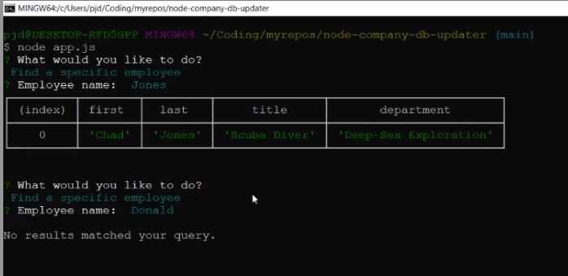

# Node.js Company DB Updater

## Table of Contents
* [About](#about)
* [Dependencies](#dependencies)
* [Installation](#installation)
* [Usage](#usage)
* [License](#license)

## About
This command-line application allows a user to view and search a database of employees using Node.js and [Inquirer.js](https://www.npmjs.com/package/inquirer).

## Dependencies
- Node.js
- [Inquirer.js](https://www.npmjs.com/package/inquirer)
- Mysql

## Installation
Node.js, MySql and Inquirer are required - `npm i` in the root directory will install Inquirer and MySql. A seed database and schema SQL file can both be found in the /schema directory.

## Usage 
`node app.js` in the root directory will provide the basic command-line GUI leveraging Inquirer. 
